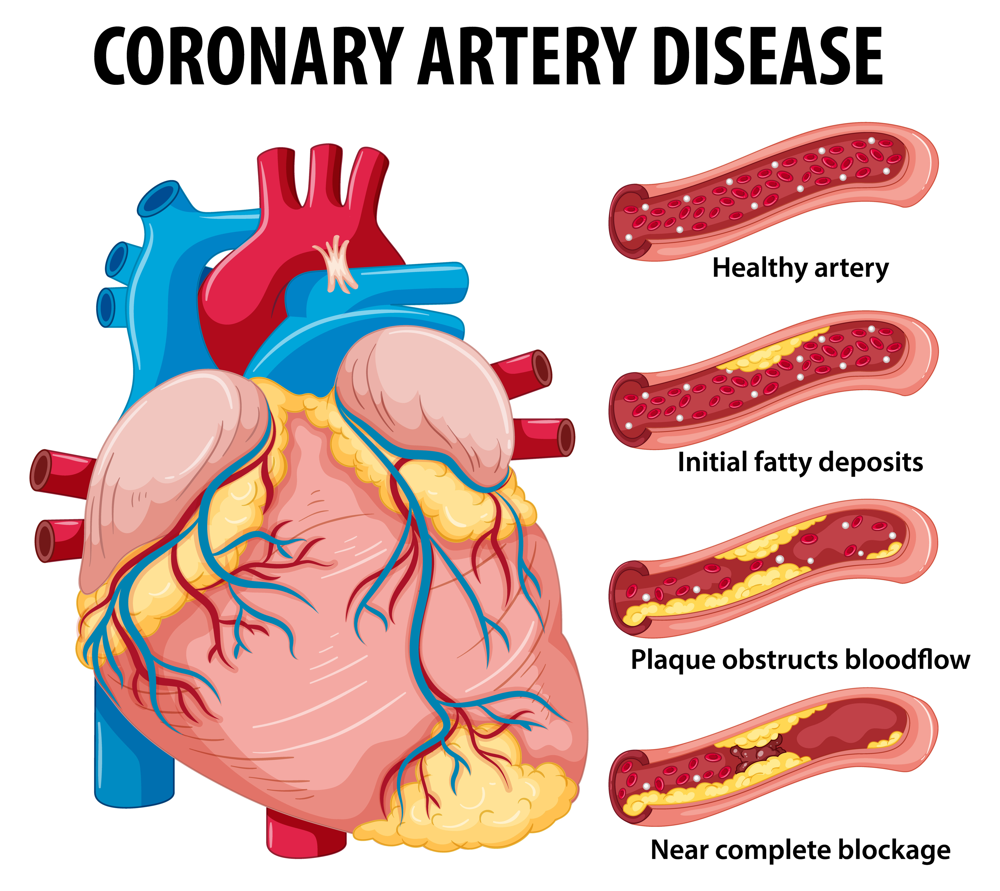

Classification of Coronary Artery Disease
=========================================

<b>Section 1: Business Understanding</b>

The business area of concern for this analysis is that of the diagnosis of Coronary Artery Disease by medical practitioners. Currently, the Gold Standard for diagnosis is Angiography. The problem we are investigating, is that in many settings too many Angiograms are being performed which could result in poorer patient care and outcomes.

Coronary Artery Disease (CAD ) is a disease in which there is a narrowing or blockage of the coronary arteries (blood vessels that carry blood and oxygen to the heart). Coronary heart disease is usually caused by atherosclerosis (a buildup of fatty material and plaque inside the coronary arteries).

We attempt to answer the following business questions by performing this analysis.

#### Question 1
* Can data science be used to improve the diagnosis of Coronary Artery Disease by means of using existing data sources?

#### Question 2
* Can data science be used to reduce the number of Angiograms performed in settings where this is problematic?

We will attempt to answer these questions by interrogating data available to us.

[Heart Disease Dataset](https://archive.ics.uci.edu/ml/datasets/Heart+Disease "Heart Disease Dataset")
 
Approach
======== 
 
I used PyCharm for development, and the virtual environment files (for both MacOS and Windows) generated by PyCharm (and used by the project) are also uploaded to GitHub. The environment can hence be reproduced. The requirements.txt document in the root directory of this project contains all dependencies in case the environment needs to be rebuilt from scratch.

I chose the Jupyter Notebook tool for exploration. The notebook is heavily annotated with comments on the analysis and should be used as the primary source for evaluating the analysis. The notebook also contains many graphs. A static version of the Notebook can be accessed [here](https://github.com/LourensWalters/Projects/blob/main/cor_art_dis/notebooks/explore_data_2020_10_24_fin.ipynb "here") for purposes of viewing the analysis.  

I used the cookiecutter Machine Learning source code template for this project. This template organises code, data and documentation in a structured manner which allows for flexible exploration of data and structured deployment of production ready code. I focused on the exploratory part of the analysis, eliciting as much information from the data as possible. Future work would be to refactor the code for production readiness. I have started this process by moving some of the code to modules which are referenced from the notebook, and hence the src/visualization directory contains most of the plots contained in the Notebook. If the Notebook is to be run offline the src/ directories will need to be linked the notebook.  

Project Organization
------------

    ├── LICENSE
    ├── Makefile           <- Makefile with commands like `make data` or `make train`
    ├── README.md          <- The top-level README for developers using this project.
    ├── data
    │   ├── external       <- Data from third party sources.
    │   ├── interim        <- Intermediate data that has been transformed.
    │   ├── processed      <- The final, canonical data sets for modeling.
    │   └── raw            <- The original, immutable data dump.
    │
    ├── docs               <- A default Sphinx project; see sphinx-doc.org for details
    │
    ├── models             <- Trained and serialized models, model predictions, or model summaries
    │
    ├── notebooks          <- Jupyter notebooks. Naming convention is a number (for ordering),
    │                         the creator's initials, and a short `-` delimited description, e.g.
    │                         `1.0-jqp-initial-data-exploration`.
    │
    ├── references         <- Data dictionaries, manuals, and all other explanatory materials.
    │
    ├── reports            <- Generated analysis as HTML, PDF, LaTeX, etc.
    │   └── figures        <- Generated graphics and figures to be used in reporting
    │
    ├── requirements.txt   <- The requirements file for reproducing the analysis environment, e.g.
    │                         generated with `pip freeze > requirements.txt`
    │
    ├── setup.py           <- makes project pip installable (pip install -e .) so src can be imported
    ├── src                <- Source code for use in this project.
    │   ├── __init__.py    <- Makes src a Python module
    │   │
    │   ├── data           <- Scripts to download or generate data
    │   │   └── make_dataset.py
    │   │
    │   ├── features       <- Scripts to turn raw data into features for modeling
    │   │   └── build_features.py
    │   │
    │   ├── models         <- Scripts to train models and then use trained models to make
    │   │   │                 predictions
    │   │   ├── predict_model.py
    │   │   └── train_model.py
    │   │
    │   └── visualization  <- Scripts to create exploratory and results oriented visualizations
    │       └── visualize.py
    │
    └── tox.ini            <- tox file with settings for running tox; see tox.readthedocs.io

--------

<small>Project based on the <a target="_blank" href="https://drivendata.github.io/cookiecutter-data-science/">cookiecutter data science project template</a>. #cookiecutterdatascience</small>

