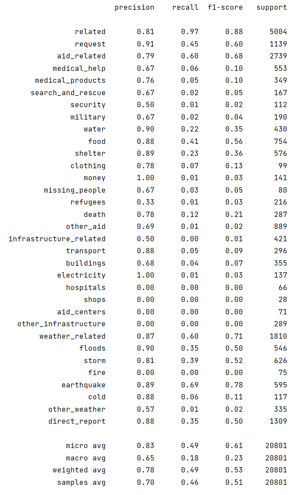
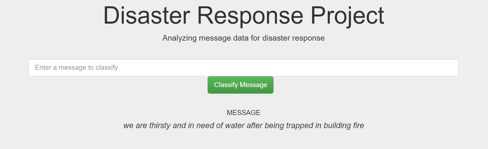
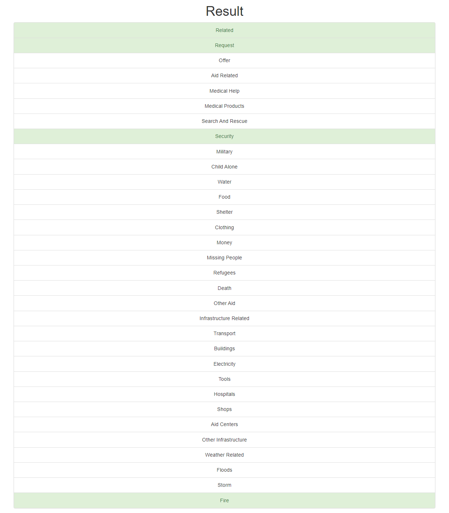
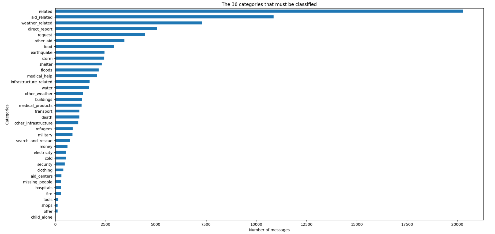
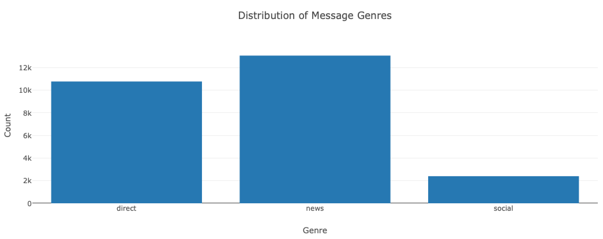
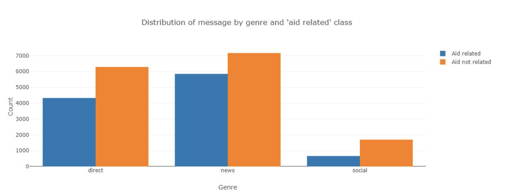

# Overview
The purpose of this project is to build machine learning pipeline, which consists of Natural Language Processing model and Classification model, to categorize disaster response messages appropriately according to which disaster relief agency the message should be sent to. The project includes a web app which an emergency worker can use to input a message to obtain a classification indicating where the message should be sent to.

# Components
The project is divided into three components:

1. **ETL Pipeline:** Load datasets, clean the data and store it in a SQLite database.
2. **ML Pipeline:** Build a text processing and machine learning pipeline, train a model to classify text message in categories.
3. **Flask Web App:** Display model results in real time.

# Requirements
- Python 3.10
- Machine Learning Libraries: NumPy, SciPy, Pandas, Sciki-Learn
- Natural Language Process Libraries: NLTK
- SQLlite Database Libraqries: SQLalchemy

# Instructions:
1. Run the following commands in the project's root directory to set up the database and model.

    - To run ETL pipeline that cleans data and stores in database
      `python data/process_data.py data/disaster_messages.csv data/disaster_categories.csv data/disaster.db`
    - To run ML pipeline that trains classifier and saves
      `python models/train_classifier.py data/disaster.db models/classifier.pkl`

2. Run the following command in the app's directory to run the web app.
   `python run.py`

3. Go to http://0.0.0.0:3001/

# Project Organization

    ├── README.md                <- The top-level README for developers using this project.
    ├──  app                     <- Contains app related files. 
    │   ├── run.py               <- Run the webapp.
    │   ├── templates            <- Webapp templates.
    │      ├── go.html           <- Classification results. 
    │      ├── master.html       <- Main page.
    ├──  data              
    │   ├── categories.csv     <- Data to process.
    │   ├── messages.csv       <- Data to process.
    │   ├── process_data.py    <- Script to process data.
    │   └── disaster.db        <- Processed data.
    ├── images                       
    │   └── various images     <- Generated graphics and figures to be used in reporting
    │
    ├── models                      <- Trained and serialized models, model predictions, or model summaries
    │   ├── train_classifier.py     <- Training script.
    │   ├── classifier.pkl          <- Saved model.
    │
    ├── ETL Pipeline Preparation.ipynb    <- ML Pipeline preparation notebook.
    └── ETL Pipeline Preparation.ipynb    <- ETL Pipeline preparation notebook. 

# Classification Model
The dataset is imbalanced (i.e. some labels like water have relatively few examples) which contributes to a lower score for categories with fewer data points. The overall accuracy score is lower as a result. For imbalanced datasets, accuracy as a metric for model evaluation is not preferred. Metrics based on FNs are more important than ones based on FPs in this case. Models exhibiting low FNs ensure that all messages are sent to the appropriate disaster relief agency, which minimises the likelihood of some urgent messages (FNs) being missed. On the other hand this for inaccurate models this is likely to result in many FPs, which means agencies will have to sift through many incorrect messages. Therefore, it is important to have a classification model that shows low number of FNs -> high recall value, whilst keeping FPs as low as possible -> high precision value.

  

The overall F1 scored micro-averaged across all the categories is 61%, which is quite low for an application such as this. The recall across all the categories is only 49%, which means 51% of potential messages will be completely missed. 

From the accuracy output it is clear that model needs substantial work in order to be deployed. Next steps would be to address the class imbalance in the model. One could attempt upsampling of data categories by using MLSMOTE for instance, or try a few other "multiclass-multioutput" classification algorithms such as tree based ones or KNeighbours based algorithms.

# Acknowledgements
- [Udacity](https://www.udacity.com) for providing such an interesting and meaningful project
- [Figure Eight](https://appen.com) for providing real-world dataset

# Results
1. Prompt to input a message for classification.

  

2. Example: The categories which the message belongs to are highlighted in green.

  

3. Overview of Training Dataset

  

   

   

